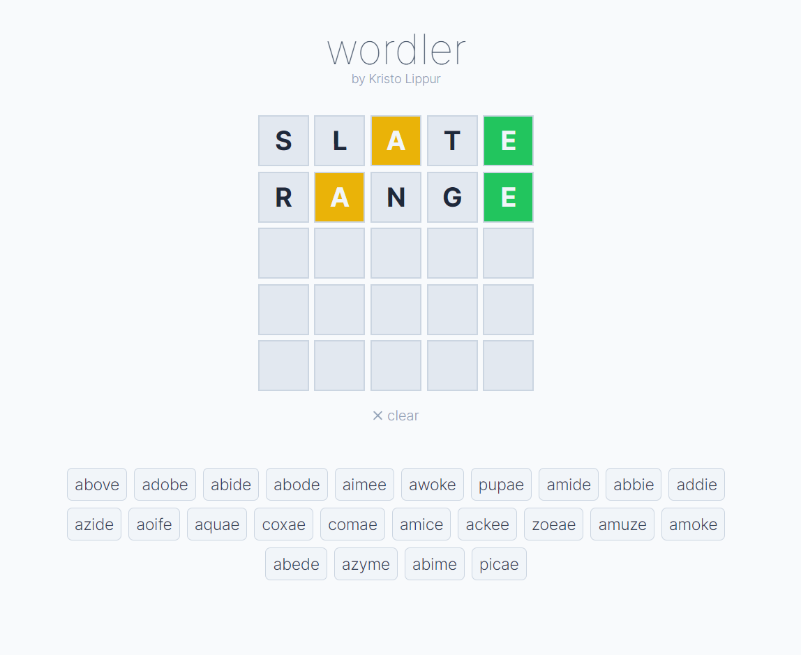

# Wordler 🟩🟨⬛

*Just another Wordle solver.*   

Answers are sorted by frequency of use in the English language, making the top suggestions somewhat more likely to be an actual Wordle answer.  

**Try it out**: [wordle.lippur.com](https://wordle.lippur.com/)

Written in Typescript using Next.js / React

